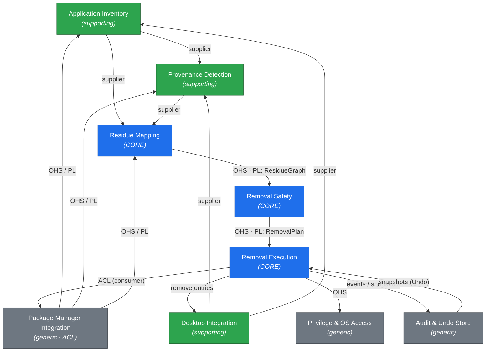

# CONTEXT_MAP.md — App-Remover

> Stage 0 (Conceptual). Bounded contexts and their relationships. Strictly conceptual.
> Companion to [DOMAIN.md](./DOMAIN.md); both use the same Ubiquitous Language.

## 1. Purpose

Define the **bounded contexts** of App-Remover, what each owns, and **how they integrate** — so that
later stages (requirements, spec, code) respect clean boundaries and do not let package-manager or
OS concerns leak into the core domain.

**Integration-pattern legend** (Evans / Vernon):
`U` = Upstream supplier · `D` = Downstream consumer · `OHS` = Open-Host Service · `PL` = Published
Language · `ACL` = Anti-Corruption Layer · `CF` = Conformist · `SK` = Shared Kernel · `CS` =
Customer-Supplier · `P` = Partnership · `SW` = Separate Ways.

---

## 2. Bounded Contexts

| Context | Type | Owns (key aggregates) | Depends on |
|---|---|---|---|
| **Residue Mapping** | Core | `ResidueGraph`, `Artifact` | Inventory, Provenance Detection, PM Integration (ACL) |
| **Removal Safety** | Core | `RemovalPlan`, `RemovalOperation` | Residue Mapping, Inventory (for Owner Sets) |
| **Removal Execution** | Core | `RemovalJob`, `ExecutedStep`, `Snapshot` | Removal Safety (plan), PM Integration (ACL), Desktop Integration, Privilege, Audit |
| **Application Inventory** | Supporting | installed-app catalog (read model) | PM Integration (ACL), Desktop Integration |
| **Provenance Detection** | Supporting | `Application` identity + `Provenance` | PM Integration (ACL), Desktop Integration, Inventory |
| **Desktop Integration** | Supporting | `.desktop` entries, icons, mimetypes, app-menu | PM Integration (ACL, read) |
| **Package Manager Integration (PMI)** | Generic | adapter sessions for apt/dpkg, snap, flatpak, AppImage, pip/npm, manual, systemd | OS only |
| **Privilege & OS Access** | Generic | privilege escalation, filesystem/service primitives | OS only |
| **Audit & Undo Store** | Generic | `AuditRecord`, snapshot store | — |

> Type rationale: **Core** = where the product's hard, differentiating logic lives (deep purge,
> safety, reversible execution). **Supporting** = necessary plumbing that could be swapped.
> **Generic** = undifferentiated infrastructure best isolated behind an ACL/OHS.

---

## 3. Context Map (Diagram)

*Arrow direction = supplier (upstream) → consumer (downstream).*

---

## 4. Relationships (Detail)

| # | Upstream (U) | Downstream (D) | Pattern | Published Language / Contract |
|---|---|---|---|---|
| R1 | Package Manager Integration | Application Inventory, Provenance Detection, Residue Mapping | **OHS + PL**, with **ACL** on the D side | A uniform query surface (installed packages, file ownership, services, reverse-deps) abstracting apt/snap/flatpak/etc. |
| R2 | Desktop Integration | Provenance Detection, Application Inventory | **CS** (supplier) | Desktop-entry model (parsed `.desktop`, icon, mimetype) |
| R3 | Application Inventory | Provenance Detection, Residue Mapping | **CS** (supplier) | Installed-application read model |
| R4 | Provenance Detection | Residue Mapping | **CS** (supplier) | `Application` + `Provenance` (InstallSources) |
| R5 | Residue Mapping | Removal Safety | **OHS + PL**, **CF** on D side | `ResidueGraph` schema (artifacts + Owner Sets) |
| R6 | Removal Safety | Removal Execution | **OHS + PL** | `RemovalPlan` (ordered operations + verdicts + impact) |
| R7 | Package Manager Integration | Removal Execution | **OHS + PL**, **ACL** on D side | Uniform command surface (uninstall, stop-service, delete, query-orphans) |
| R8 | Desktop Integration | Removal Execution | **CS** (supplier of "remove entry" command) | Desktop-entry mutation commands |
| R9 | Privilege & OS Access | Removal Execution | **OHS** | Privileged operation execution with scoped elevation |
| R10 | Removal Execution | Audit & Undo Store | **CS** (Execution emits events/records) | Removal-event stream (see [DOMAIN.md §4.6](./DOMAIN.md)) + Snapshot contract |
| R11 | Audit & Undo Store | Removal Execution | **CS** (supplier for Undo) | Snapshot read model for restore |

### Partnership candidates
- **Removal Safety ⇄ Removal Execution (R6):** tightly coupled around the `RemovalPlan` lifecycle (approve → execute → rollback can re-open planning). Model as **OHS + PL** by default, with a **Partnership** fallback if the two teams/areas are co-developed and must coordinate changes.

---

## 5. Shared Kernel

A deliberately small kernel shared across Inventory, Provenance Detection, Residue Mapping, and
Removal Safety. Keeping it tiny is the point — anything larger should become an OHS instead.

- **Canonical Application identity** (`CanonicalAppId`) — so every context refers to the same app.
- **Path / Artifact value model** — a normalized representation of a filesystem path or system object,
  so Owner Sets and Impact are computed on identical terms.

> Rule of thumb: the shared kernel holds only **identity and value types** — never behavior or
> aggregates. A change here is expensive and requires all kernel consumers to agree.

---

## 6. Anti-Corruption Layers (ACLs)

The domain must not absorb the vocabulary or quirks of Linux package tooling. ACLs translate at the
boundary:

- **Package Manager Integration** is itself a single ACL-presenting context: each backend
  (`apt/dpkg`, `snap`, `flatpak`, AppImage, pip/npm, manual, `systemd`) is isolated behind one
  conforming adapter, exposing the uniform **PL** from R1/R7. The core never sees `dpkg -L`,
  `snap list`, or `flatpak uninstall` directly.
- **Removal Execution** consumes that surface through its own thin ACL (R7), so execution logic is
  expressed in domain operations (`uninstall-package`, `stop-service`, `delete-file`), not shell.
- **Desktop Integration** isolates `.desktop`/mimetype/menu-spec details from the core.

---

## 7. Open Questions — Boundary-Sensitive

These cross-cut the map and shape where responsibilities ultimately land. Carry into Stage 1.

1. **Owner-Set source of truth.** R1/R5 assume a uniform file-ownership model across package systems, but `dpkg` cannot see snap/flatpak/AppImage files. *Where* is the authoritative Owner Set computed, and is it a new context or part of Residue Mapping? (See DOMAIN.md §6 Q2.)
2. **Canonicalization home.** Is "resolve a clicked icon to one Canonical Application across colliding installs" owned by Provenance Detection alone, or a Shared-Kernel concern? (Q3.)
3. **Privilege boundary placement.** Does Privilege & OS Access wrap *only* PM Integration, or also direct filesystem/service operations in Execution (R9)? Affects whether R9 is an OHS or merged.
4. **Undo ownership.** Is Undo/Restore driven by Removal Execution (using Audit snapshots) or a distinct user-facing context that commands Execution? R10/R11 direction depends on the answer.
5. **Interaction surface & context split.** "Click an icon" implies a GUI/client, but the stack is a Node backend. Is there a separate **UI/Client context** that talks to a local App-Remover service? If so, an additional **OHS/PL (application API)** sits between client and core contexts. (Architectural; affects the whole map.)
6. **Knowledge base of known residues.** If Residue Mapping relies on a curated KB (Revo-style), is that KB a supporting context or configuration data inside Residue Mapping? (Q4.)
7. **Protected-Apps policy location.** Where does the blocklist live and which context enforces it (Removal Safety vs. a policy/governance context)? (Q7.)
