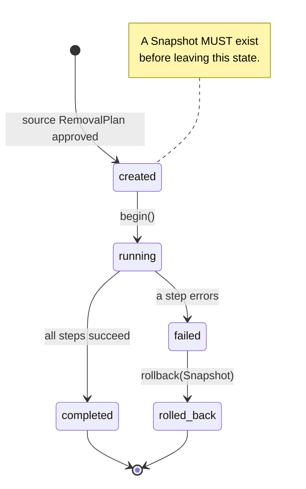

# DOMAIN.md — App-Remover

> Stage 0 (Conceptual). Source of truth for the domain model. Strictly conceptual —
> technology, frameworks, and data formats are out of scope here and belong in later stages.
> Inputs: `raw_idea.txt`.

## 1. Product Vision & Problem Statement

**App-Remover** is a thorough, safe application uninstaller for Ubuntu (Linux) desktop users —
"Revo Uninstaller for Linux." The user selects an application (typically by clicking its desktop
icon). App-Remover determines *how* that application was installed, computes *everything* associated
with it, and removes it completely **without breaking any other installed application**.

The product exists because native package tools (`apt`, `snap`, `flatpak`) each:

- manage only their own packaging system,
- leave behind configuration, cache, user data, services, and associations ("residue"),
- cannot reason across systems about whether a file/dependency is still needed by *another* app.

App-Remover's value is the union of three hard problems: **deep residue discovery**, **cross-system
impact/safety analysis**, and **reversible execution**.

### Core Domain (the differentiator)

The strategic core — the parts worth building expertise around — is:

1. **Residue Mapping** — discovering the complete set of artifacts belonging to an application.
2. **Removal Safety** — deciding what may be removed without harming other applications.
3. **Removal Execution** — performing the removal in a correct, ordered, reversible way.

Everything else (inventory, install-type detection, desktop plumbing, package-manager adapters)
is *supporting* or *generic* — necessary, but not where the product wins.

### Design Principles

These follow directly from the raw idea ("feature rich yet minimal in design") and constrain every later
decision:

- **Minimality by construction.** The domain is deliberately small — few core aggregates, a tiny
  [Shared Kernel](./CONTEXT_MAP.md). "Feature rich" is achieved by adding *adapters* in the generic
  Package Manager Integration context behind an ACL, never by bloating the core.
- **Core purity.** Core aggregates carry no I/O and know nothing of `apt`/`snap`/`flatpak`; all external
  concerns live in supporting/generic contexts (see [CONTEXT_MAP.md §6](./CONTEXT_MAP.md)).
- **Safety over completeness.** When residue knowledge is uncertain, the model surfaces risk
  (`risky` / `manual-review`) rather than silently removing — "without breaking any other" outranks
  "purge everything" (see Open Questions, §6).

---

## 2. Sub-Domains

| Sub-Domain | Type | Responsibility |
|---|---|---|
| **Residue Mapping** | Core | Build the complete `ResidueGraph` of artifacts owned by an application. |
| **Removal Safety** | Core | Classify each artifact/package by exclusivity, compute impact on other apps, produce an approved `RemovalPlan`. |
| **Removal Execution** | Core | Run an approved plan in dependency-correct order, with snapshot + rollback. |
| **Application Inventory** | Supporting | Enumerate installed applications across all package systems. |
| **Provenance Detection** | Supporting | Resolve a desktop entry/icon to one canonical application and its install method(s). |
| **Desktop Integration** | Supporting | Manage `.desktop` entries, icons, mimetypes, and app-menu artifacts; the click entry point. |
| **Package Manager Integration** | Generic | ACL adapters over `apt/dpkg`, `snap`, `flatpak`, AppImage, pip/npm, manual files, `systemd`. |
| **Privilege & OS Access** | Generic | Acquire and scope elevated privileges (polkit/pkexec/sudo) for privileged operations. |
| **Audit & Undo Store** | Generic | Persist removal history, snapshots, and enable restore/undo. |

---

## 3. Ubiquitous Language

A single vocabulary used identically in code, specs, and conversation. *Terms are conceptual; they
do not imply a storage format.*

| Term | Definition |
|---|---|
| **Application (App)** | A user-facing installed program; the unit a user wants to remove. |
| **Removal Target** | The specific `Application` instance selected for removal (may resolve to several `PackageInstances`). |
| **Desktop Entry** | A `.desktop` file (icon) representing an app in the desktop environment. |
| **Canonical Application** | The resolved, disambiguated identity of an app, after collapsing duplicates across package systems. |
| **Install Method (Provenance)** | How an app was installed: `deb/apt`, `snap`, `flatpak`, `AppImage`, `manual/script`, `language-package` (pip, npm), `container`. |
| **Package Instance** | One concrete unit in a package manager (e.g. one deb, one snap) backing an Application. An Application may have several. |
| **Artifact (Residue)** | Anything associated with an app: binary, config, cache, user data, runtime state, service, mimetype, desktop entry, dependency. |
| **Artifact Category** | Classification of an artifact: `binary`, `config`, `cache`, `data`, `state`, `service`, `desktop-entry`, `association`, `dependency`. |
| **Owner Set** | The set of applications that reference/use a given artifact. |
| **Residue Graph** | The complete computed set of artifacts for one Removal Target, each annotated with its Owner Set. |
| **Exclusive Artifact** | An artifact whose Owner Set contains *only* the Removal Target → safe to remove. |
| **Shared Artifact** | An artifact whose Owner Set contains other applications → removing risks breaking them. |
| **System Artifact** | An artifact belonging to the OS/desktop itself → never removed. |
| **Reverse Dependency (RDep)** | What depends on a given package; the basis for package-level impact analysis. |
| **Orphan** | A dependency/package no longer required by any remaining application → safe to prune. |
| **Impact** | The set of *other* applications that would break if an artifact/package were removed. |
| **Removal Plan** | The ordered, classified set of `RemovalOperations` with safety verdicts, produced *before* execution. |
| **Removal Operation** | One atomic action in a plan (e.g. uninstall-package, stop-service, delete-file, remove-association), with an order, action, and verdict. |
| **Safety Verdict** | Per-operation decision: `safe`, `risky`, `blocked`, `manual-review`. |
| **Purge** | Remove the app **and** all its exclusive residues (deep clean). |
| **Remove** | Uninstall only the package(s) (shallow). |
| **Dry Run** | Compute and present the `RemovalPlan` without executing anything. |
| **Snapshot** | Captured pre-removal state (files/package list) enabling Undo. |
| **Removal Job** | The execution of an approved plan; a state machine from `created` → `completed` / `rolled-back`. |
| **Rollback** | Revert a partially-failed job using its Snapshot. |
| **Undo / Restore** | User-initiated reversal of a previously completed removal, using an Audit record + Snapshot. |
| **Leftover Sweep** | Post-removal pass that detects any residue the plan missed. |
| **Protected App** | A system-critical app whose removal is forbidden (blocklist). |

---

## 4. Aggregates

Consistency boundaries. Each aggregate enforces its invariants internally; cross-aggregate
references use **identity** (ids), not object pointers.

### 4.1 Application (Root) — *the removal target*

The thing the user wants gone. Owns its identity and provenance; *references* (does not own) its
packages and residue graph.

- **Identity:** `CanonicalAppId`
- **Entities:** — (the Application itself)
- **Value Objects:** `CanonicalAppId`, `AppName`, `DesktopEntryRef` (path + parsed `.desktop` content), `Provenance` (set of `InstallSource` {method, confidence, evidence}), `PackageInstanceRef[]`
- **Invariants:**
  - Resolves to **≥ 1** `InstallSource` with evidence, OR is explicitly a `manual` install — never both unknown and removable.
  - Canonical identity is established (duplicates across systems resolved) **before** any planning.
  - Not a `Protected App`.
- **Notable behavior (conceptual):** `resolveFrom(desktopEntry) → Application`; `mergeDuplicates()`.

### 4.2 ResidueGraph (Root) — *what belongs to the app*

The complete artifact inventory for one Removal Target. This is the heart of "purge all associated."

- **Identity:** `{ ApplicationId, ScanVersion }`
- **Entities:** `Artifact` (id, target/path, category, owner-set, size, deletable-flag)
- **Value Objects:** `ArtifactCategory`, `Path`, `OwnerSet`, `UsageKind` (`exclusive` | `shared` | `system`), `Evidence`
- **Invariants:**
  - Every `Artifact`'s Owner Set **must** include the owning Application.
  - `UsageKind` is *derived* from Owner Set size: exactly one → `exclusive`; >1 → `shared`; OS-owned → `system`.
  - `system` artifacts are never deletable.
  - A ResidueGraph is **immutable** once sealed; a re-scan produces a new `ScanVersion`.
- **Notable behavior:** `scan(application) → ResidueGraph`; `classifyUsage()`; `filter({exclusiveOnly})`.

### 4.3 RemovalPlan (Root) — *the safety boundary*

The decision artifact. This aggregate is where **"without breaking any other"** is enforced — no
plan may be approved while it still contains an operation that harms another app.

- **Identity:** `PlanId`
- **Entities:** `RemovalOperation` (target artifact/package, action, order, verdict, impact)
- **Value Objects:** `Action` (`uninstall-package` | `stop-service` | `delete-file` | `remove-association` | `prune-orphan`), `SafetyVerdict`, `Impact` (list of affected apps), `Order`, `DependencyGraph` (a transient model of package/service reverse-dependencies derived from **Reverse Dependency** data via the PM ACL — computed within this context, never persisted).
- **Invariants:**
  - No operation with non-empty `Impact` may carry verdict `safe`.
  - Any operation whose verdict is `blocked` **disqualifies** the plan from reaching `approved`.
  - `risky` operations require explicit, recorded user acceptance before approval.
  - **Ordering rules:** dependents are removed before their dependencies; services are stopped before their files are deleted; packages are removed before the residue sweep runs; orphans pruned last.
  - A plan is **immutable once approved**; changing inputs yields a new plan.
- **Notable behavior:** `compose(residueGraph, dependencyGraph) → RemovalPlan`; `dryRun()`; `approve(acceptedRisks)`; `toExecutionOrder()`.

### 4.4 RemovalJob (Root) — *reversible execution*

The live run of an approved plan.

- **Identity:** `JobId`
- **Entities:** `ExecutedStep` (operation ref, status, timestamp, error)
- **Value Objects:** `JobStatus` (`created` → `running` → `completed` | `failed` → `rolled-back`), `SnapshotRef`, `Failure`
- **Invariants:**
  - A `Snapshot` **must** exist before the job may leave `created`.
  - On any step failure, the job **must** `rollback` using the Snapshot before reaching a terminal state.
  - Status transitions follow the state machine strictly (no `completed` → `running`).
  - A job cannot start unless its source `RemovalPlan` is `approved`.
- **Notable behavior:** `begin()`; `executeNextStep()`; `rollback()`; `complete()`; `sweepLeftovers()` (a post-completion pass that detects residue the plan missed and may yield a fresh `ResidueGraph` for a follow-up plan — the realization of **Leftover Sweep**, §3).

**State machine:**

No transition skips the snapshot gate, and `failed` can only reach a terminal state through `rolled_back` (a partial removal is never a final state).

### 4.5 Supporting / Generic Aggregates (brief)

- **AuditRecord** (generic, Audit & Undo Store): one immutable record per completed/failed job; identity `JobId`; supports `Undo/Restore`.
- **PackageManagerSession** (generic, integration): not a true aggregate — an anti-corruption adapter exposing a uniform query/command surface (see CONTEXT_MAP.md).

### 4.6 Domain Events (conceptual)

State changes of consequence are expressed as **Domain Events** — immutable, past-tense facts published
*after* an invariant has been satisfied (never before). They are how the core aggregates communicate with the
supporting/generic contexts: they are the source of the immutable `AuditRecord` (§4.5 — an `AuditRecord` is
the durable projection of one `RemovalJob`'s event stream), and the granularity at which progress is reported
to the client. Events carry data, never behavior.

| Event | Emitted by | Meaning (carries) |
|---|---|---|
| `ApplicationResolved` | Application | Canonical Application + Provenance established for a Removal Target. |
| `DisambiguationRequired` | Application | Distinct install instances exist; the user must choose before planning may start. |
| `ResidueGraphSealed` | ResidueGraph | A scan completed and became immutable at a `ScanVersion`. |
| `RemovalPlanComposed` | RemovalPlan | A plan (operations + verdicts + impact) was computed — the Dry Run output. |
| `RemovalPlanApproved` | RemovalPlan | The plan reached `approved` with every `risky` acceptance recorded. |
| `SnapshotCaptured` | RemovalJob | A pre-execution Snapshot was taken — the gate for `created` → `running`. |
| `StepExecuted` / `StepFailed` | RemovalJob | A single operation succeeded / failed (drives `ExecutedStep` records + progress). |
| `JobCompleted` | RemovalJob | All steps succeeded; terminal. |
| `JobRolledBack` | RemovalJob | A failed job was reverted via its Snapshot; terminal. |
| `LeftoversDetected` | RemovalJob | The post-completion Leftover Sweep found residue the plan missed. |

> Events are named for the aggregate that emits them. They do not introduce new invariants; they *announce*
> that an invariant held (e.g. `SnapshotCaptured` announces the §4.4 snapshot gate was satisfied).

---

## 5. Core Domain Rules (Invariants Summary)

1. **Resolve before remove.** An Application must reach canonical identity + provenance before planning.
2. **Owner-aware removal.** An artifact is removable only if its Owner Set is exactly {Removal Target}; otherwise it is shared/system and protected by default.
3. **Impact-gated approval.** A plan is approvable only when no remaining operation harms another app (or each such operation is explicitly accepted as risk).
4. **Protected Apps.** System-critical apps are never removable.
5. **Snapshot-before-execute.** No destructive step runs without a Snapshot enabling rollback.
6. **Fail-safe ordering.** Operations execute in dependency-correct order; failure triggers rollback, never a half-removed system.

---

## 6. Open Questions — Missing Business Logic

The raw idea is high-level. The following domain rules are **not yet defined** and must be answered
in Stage 1 (Requirements) before a trustworthy spec can be written. They are flagged here, not solved.

1. **Definition of "associated residue."** Exactly which locations/objects count as artifacts? (`~/.config`, `~/.cache`, `~/.local/share`, `/etc`, `/var/lib`, dconf/gsettings, user systemd units, cron jobs, shell-rc edits, mimetypes, thumbnails?) No residue *policy* is specified.
2. **Definition of "without breaking any other."** What is the source of truth for "who owns/uses a file"? `dpkg` only tracks deb packages; snap/flatpak/AppImage files are invisible to it. Is breakage measured by shared-file ownership, package reverse-dependencies, or both?
3. **Cross-system collisions.** The same app may be installed via apt **and** snap **and** flatpak (e.g. Firefox). When the user clicks the icon, which install is the target? Canonicalization/disambiguation policy is undefined.
4. **Residue discovery strategy.** Pure naming heuristics (`~/.config/<appname>`)? A curated knowledge base of known residues (Revo-style)? Package manifests? Or a blend? Not specified.
5. **Privilege model.** Removal of system files requires root. How is privilege acquired and scoped (polkit/pkexec/sudo), per-operation or per-session? Undefined.
6. **Undo/rollback completeness.** How thorough must a Snapshot be to truly undo? File-level backup of deleted configs? Re-download/reinstall packages? What are the network and time assumptions?
7. **Protected-Apps policy.** Which apps/system components are forbidden to remove (the DE, glibc, display server, App-Remover itself)? No blocklist defined.
8. **User vs. system scope.** Does a removal affect one user's data only, or the app system-wide? Behavior on multi-user systems is unspecified.
9. **Non-packaged apps.** How are AppImage, extracted tarballs, compiled-from-source, pip/npm-global, and container images detected, and what is their residue model?
10. **Concurrency.** What if the app is running/being updated during removal? Service/lock handling is unspecified.
11. **Snapshot disk cost.** Snapshotting large caches before removal may be expensive; a cost/cap policy is undefined.
12. **Dry-run / preview UX.** A non-destructive preview before purging is implied by Revo parity but not stated as a requirement.
13. **Interaction surface (GUI vs. daemon).** "Click icon" implies a GUI, but the stack is a Node backend. Is there a frontend/local daemon, and how does the click reach App-Remover? (Architectural, but it shapes context boundaries — see CONTEXT_MAP.md.)
14. **Confirmation & risk acceptance.** How are `risky`/`manual-review` verdicts surfaced to and accepted by the user? Workflow undefined.
